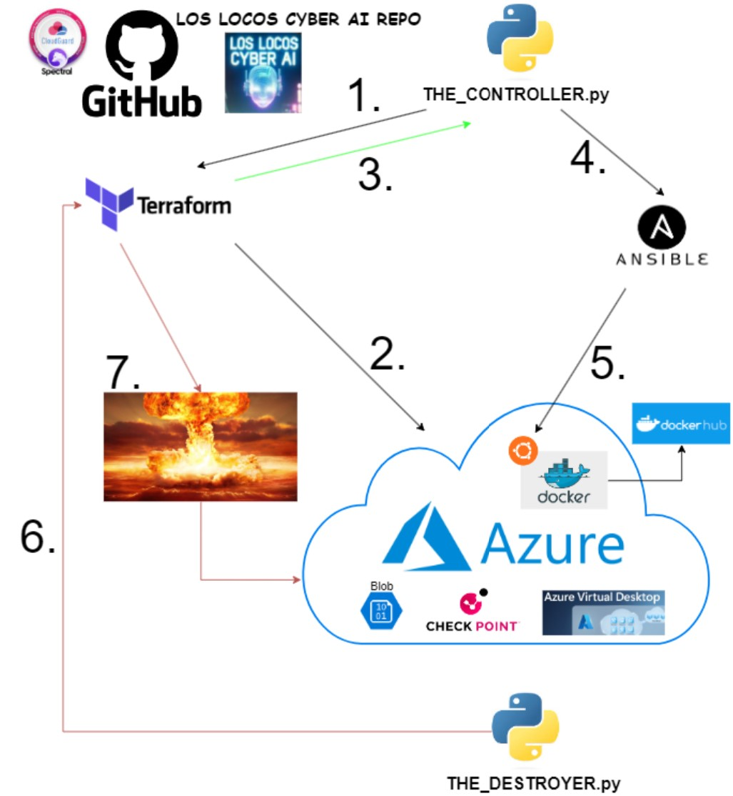

## check-point-se-lab

## **The fully IaC Check Point SE Lab**

**This kit contains a fully modular, scalable, and customizable IaC Cloud lab designed to be deployed in Microsoft Azure.**

**developed by**

**Raffi Ali, Hector Mora, Frank Rivas, and Travis Lockman**

**tHe fLoRiDa tEaM**


-------------------------------------------------------------
------------------------------------------------------------


## **Content**
The lab is created with Python, Terraform, Ansible, Docker.
It is built to execute from any linux platform, into AWS and/or Azure.

*--Python--*

*THE_CONTROLLER.py* - Oversees the running of all code, executes and processes output across the platform.

*--Terraform--*

*--Ansible--*

*--Docker--*


## **Environment Prep**

More to come


**Terraform Execution**

Inside the azure and/or aws folder:

`terraform init`

More to come...


## **How To Use This Lab**

More to come:

```python
python3 THE_CONTROLLER.py
```


## **Acknowledgements**

Kobe Bryant, and more to come.
But did you destroy....?